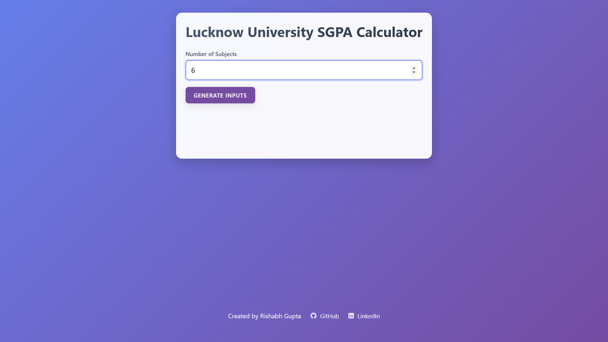

# 🎓 Lucknow University SGPA Calculator

 <!-- Add your screenshot file here -->

A modern web app for calculating SGPA according to Lucknow University's grading system. Features dynamic inputs, real-time validation, and beautiful animations.

## ✨ Features

- **Dynamic Subject Inputs** - Generate fields based on subject count
- **Real-Time Validation** - Instant feedback for invalid inputs
- **Smart Animations** - Smooth UI transitions and effects
- **Mobile Friendly** - Responsive design for all devices
- **Error Handling** - Clear error messages with field highlighting
- **Social Links** - Direct access to developer profiles

## 🚀 How to Use

1. Enter number of subjects
2. Click "Generate Inputs"
3. Fill credits and grade points (0-10)
4. Click "Calculate SGPA" when enabled
5. View animated result

## 🧠 JavaScript Functionality

### Core Functions:

// Generates subject input fields dynamically

function generateSubjectInputs() {
  // Creates input cards for each subject
  // Validates subject count input
  // Adds real-time validation listeners
}

// Validates all inputs in real-time

function validateInputs() {
  // Checks for valid numbers in all fields
  // Highlights invalid inputs with red borders
  // Toggles Calculate button state
}

// Performs SGPA calculation

function calculateSGPA() {
  // Calculates weighted sum of credits*grades
  // Handles division by zero errors
  // Displays result with animation
}

// Helper Functions

function showError(message) { /* Displays error message */ }

function hideError() { /* Hides error message */ }

function showResult(sgpa) { /* Animates result display */ }

## Key Functionality

- **Dynamic UI Generation:** `generateSubjectInputs()` creates input fields using template literals.
- **Real-Time Validation:** `validateInputs()` runs on every input change using event listeners.
- **SGPA Calculation:** `calculateSGPA()` uses the formula: (Σ(Credit × Grade)) / Total Credits.
- **Error Handling:** Highlighting system using border-color changes.
- **Animation System:** CSS transitions for buttons and results.

## 🛠️ Technical Stack

### Frontend

- HTML5 Semantic Markup
- CSS3 Animations & Grid
- Vanilla JavaScript (ES6)

### Key Dependencies

- Font Awesome Icons
- CSS Gradient Backgrounds
- Modern CSS Features (Flexbox, Grid)
